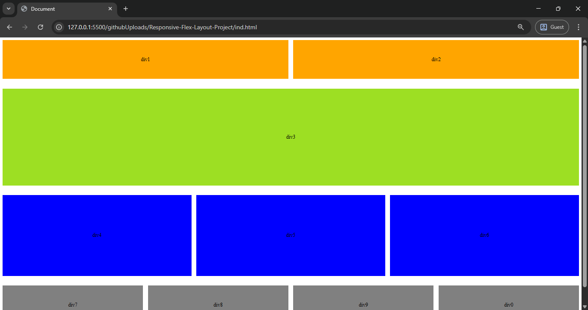

# Flex Layout Project 

## Table of contents

- [Overview](#overview)
  - [The challenge](#the-challenge)
  - [Screenshot](#screenshot)
  - [Built with](#built-with)
- [Author](#author)

## Overview

This project demonstrates a responsive Flexbox-based layout using HTML and CSS, showcasing multi-section grids, consistent alignment, and responsiveness across devices.

### The challenge

- Build a multi-section page layout using Flexbox for structure and alignment.
-Adjust layout responsively for:
-Desktop
    -Tablet (max-width: 768px)
    -Mobile (max-width: 320px)
-Maintain clear, consistent alignment and spacing using flex-basis, flex-wrap, gap, and centered alignment.

### Screenshot

### Built with

- HTML5

- CSS3 (Flexbox)

- Mobile-first responsive design practices

## Author

- Frontend Mentor - [@shrikanth-dev]
- LinkedIn - [@G Srikanth](https://www.linkedin.com/in/g-srikanth-gs)
